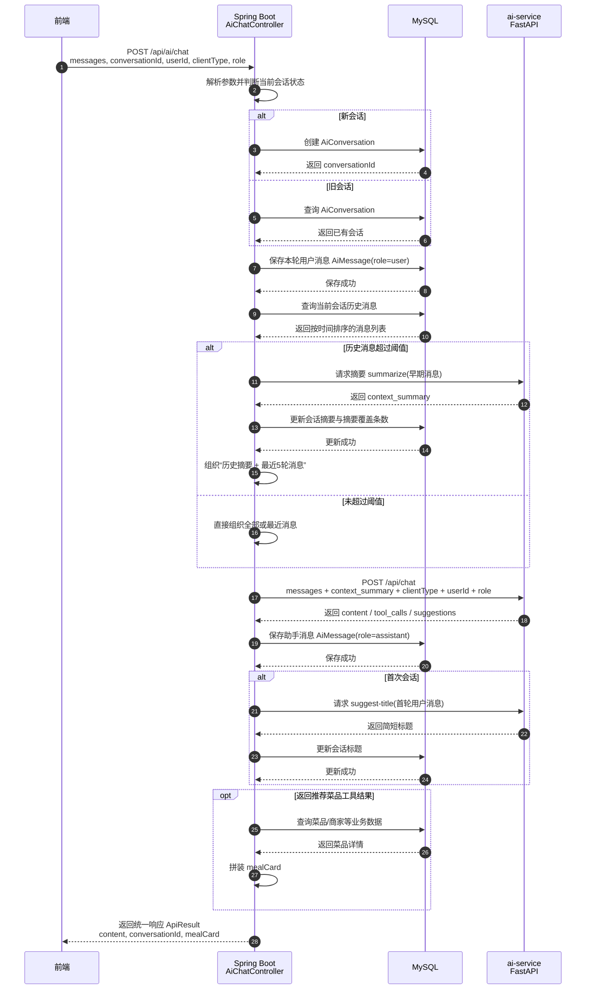

# AI 对话时序图（毕业论文）

> 适用于论文题目：**融合 Agent 的 Spring Boot 智慧食堂一体化管理平台设计与实现**

---

## 1. 这部分该画什么图

这段内容**最适合画时序图（Sequence Diagram）**，因为你要表达的重点不是静态分层，而是一次 AI 对话请求在 **前端、Spring Boot、数据库、ai-service** 之间如何按时间顺序流转。

建议这样处理：

- **主图**：画 **AI 对话时序图**
- **可选辅图**：如果你还想单独强调“最近消息 + 历史摘要”的判断逻辑，再补一张 **流程图 / 活动图**

如果只能保留一张图，优先保留 **时序图**。

---

## 2. 建议图题

- **图 5-3 AI 对话处理时序图**
- **图 5-3 智能对话请求处理时序图**
- **图 5-3 Spring Boot 与 ai-service 协同对话时序图**

如果你放在第 4 章，也可以改成 `图 4-x`。

---

## 3. 为什么用时序图

因为这段逻辑天然包含以下几个“按先后发生”的步骤：

1. 前端调用 `/api/ai/chat`
2. Spring Boot 判断是否新建会话
3. 用户消息先写入数据库
4. 读取历史消息并组织上下文
5. 超阈值时做摘要压缩
6. 将整理后的请求转发给 `ai-service`
7. AI 返回内容、建议问句、工具调用信息
8. Spring Boot 将助手消息再次写库
9. 新会话补标题，命中推荐菜品则拼装菜品卡片
10. 返回最终结果给前端

这正是时序图最擅长表达的内容。

---

## 4. Mermaid 时序图



---

## 5. 论文里的图下注释

可直接写成：

> 图 5-3 展示了智能对话功能的核心处理过程。前端统一通过 `/api/ai/chat` 发起请求，Spring Boot 后端在接收到请求后首先判断会话状态，并完成会话创建或续接；随后将用户消息写入数据库，读取历史消息并组织上下文。当历史消息超过阈值时，系统采用“历史摘要 + 最近消息”的方式压缩上下文，再将整理后的请求转发给独立部署的 ai-service。AI 服务完成推理后，返回的回复内容、建议问句及工具调用信息会再次由后端落库；若为新会话，还会自动生成标题；若命中推荐菜品工具，则进一步拼装业务卡片并返回前端。该机制体现了 Spring Boot 在智能对话中承担的会话组织、请求转发、结果回写与业务融合职责。

---

## 6. 如果还想再补一张辅图

如果导师或论文模板希望“逻辑更清楚”，你可以再加一张很小的 **流程图**，专门画“上下文压缩逻辑”：

- 接收消息
- 读取历史消息
- 判断是否超过阈值
- 是：摘要旧消息
- 否：直接使用最近消息
- 组装请求
- 转发 ai-service

也就是说：

- **时序图**：强调系统间交互
- **流程图**：强调摘要压缩判断

正文里一般有一张时序图就够了。

---

## 7. 给其他 AI / 制图工具的提示词

```text
请绘制一张“AI 对话处理时序图”，用于毕业论文插图，要求白底、简洁、学术化、蓝灰配色、中文标签清晰、适合 A4 页面。

图类型为 UML 时序图，参与者包含：
- 前端
- Spring Boot（AiChatController）
- MySQL
- ai-service（FastAPI）

时序流程如下：
1. 前端向 Spring Boot 发起 POST /api/ai/chat，请求中携带 messages、conversationId、userId、clientType、role。
2. Spring Boot 判断当前会话状态：
   - 如果是新会话，则创建 AiConversation。
   - 如果是已有会话，则查询已有会话。
3. Spring Boot 将本轮用户消息保存到 AiMessage 表。
4. Spring Boot 查询当前会话的历史消息，并按时间顺序组织上下文。
5. 如果历史消息超过阈值，则调用 ai-service 的摘要能力，将早期消息压缩为 context_summary，并把摘要写回会话表。
6. Spring Boot 组装“历史摘要 + 最近若干轮消息 + clientType + userId + role”，转发给 ai-service 的 /api/chat。
7. ai-service 返回 content、tool_calls、suggestions。
8. Spring Boot 将 assistant 消息、工具调用信息、建议问句写入数据库。
9. 如果是首次会话，则根据首轮消息生成简短标题并回写会话表。
10. 如果工具结果涉及推荐菜品，则 Spring Boot 进一步查询业务表，拼装 mealCard 返回前端。
11. 最终 Spring Boot 向前端返回统一响应 ApiResult。

绘图要求：
- 使用标准时序图形式
- 用 alt 表示“新会话 / 已有会话”
- 用 alt 表示“超过阈值 / 未超过阈值”
- 用 opt 表示“首次会话生成标题”和“推荐菜品卡片拼装”
- 突出 Spring Boot 在流程中的会话组织者和请求转发器角色
- 所有文字用中文，适合毕业论文截图或导出插图
```

---

## 8. 代码清单 5-1 的放法

你的想法是对的，这里**不建议贴整个 `AiChatController`**，正文只要保留一段“最近 5 轮消息 + 摘要压缩 + 转发 AI 服务”的核心代码即可。

建议正文写法：

- 图先说明“整体交互流程”
- 代码清单 5-1 再说明“关键实现方式”

这样结构最顺：

1. 先放 **图 5-3 AI 对话处理时序图**
2. 再引出 **代码清单 5-1 AiChatController 核心逻辑**
3. 最后用一段文字解释“为什么这样做”

---

## 9. 一句结论

这部分**首选时序图**，不是类图，也不是包图；如果你还想补充“摘要压缩”的判断细节，再加一张小流程图即可。

