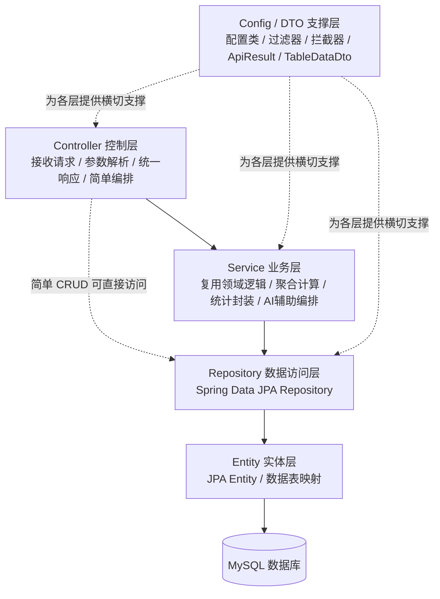

# 后端 Spring Boot 分层结构图（毕业论文）

> 适用于论文题目：**融合 Agent 的 Spring Boot 智慧食堂一体化管理平台设计与实现**

---

## 1. 图题建议

- **图 4-3 后端 Spring Boot 包分层示意图**
- **图 4-3 后端 Spring Boot 分层架构图**
- **图 4-3 后端分层设计示意图**

---

## 2. 论文式描述

后端采用 **Spring Boot** 构建，整体遵循分层式设计思路。代码结构上通常可划分为 **控制层、业务层、数据访问层、实体层、配置与 DTO 支撑层**。虽然不同模块的复杂度不完全一致，但整体上都遵循“**控制层接收请求、业务层处理逻辑、数据层访问数据库**”的基本原则。

其中，**控制层（Controller）** 负责接收前端请求、解析参数、组织统一响应，并在必要时完成简单的业务编排。对于常规 CRUD 接口，控制层可直接调用 Repository 或 Service 完成处理；对于 AI 对话等复杂接口，控制层还需要承担请求转发、会话组织、结果反序列化与返回等职责。

**业务层（Service）** 主要承载复用性较强的领域逻辑，例如评分聚合、向量检索、管理端会话处理与统计封装等。本系统并不要求每个实体都对应独立 Service，而是采用较为轻量的服务层写法，即复杂逻辑抽取为 Service，简单 CRUD 由控制层配合 Repository 完成。

**数据访问层（Repository）** 基于 **Spring Data JPA** 实现，通过 Repository 接口将数据库访问逻辑从业务代码中分离出来，减少手写 SQL 的分散程度，提高持久化层的一致性。**实体层（Entity）** 则负责与数据库表建立映射，作为控制层、业务层和持久层之间传递的数据载体。

此外，**Dto 与统一响应结构** 用于隔离前端契约与数据库实体，降低直接暴露实体对象带来的耦合；**配置层（Config）** 则用于处理跨请求行为，例如跨域、用户上下文、请求过滤与拦截等，从而为系统提供统一的横切支撑能力。

---

## 3. Mermaid 图



---

## 4. 图下注释示例

可直接放在图片下方：

> 图 4-3 展示了系统后端的 Spring Boot 分层结构。控制层位于最上层，负责处理前端请求并组织统一响应；业务层承载可复用的领域逻辑；数据访问层通过 Spring Data JPA Repository 完成持久化访问；实体层用于实现对象与数据表的映射；配置与 DTO 支撑层则为系统提供统一响应、请求过滤、跨域处理和上下文管理等横切能力。需要说明的是，本系统采用轻量服务层设计，并非所有业务均经过独立 Service，简单 CRUD 场景下控制层可直接调用 Repository，而复杂逻辑则抽取为 Service 统一处理。

---

## 5. 给其他 AI / 制图工具的提示词

```text
请绘制一张“后端 Spring Boot 分层结构图”，用于毕业论文插图，风格要求为白底、简洁、学术化、蓝灰配色、中文标签、适合 A4 论文页面。

采用自上而下的五层结构，模块全部使用矩形框表示：

第 1 层：Controller 控制层
- 接收请求
- 参数解析
- 统一响应
- 简单业务编排

第 2 层：Service 业务层
- 复用领域逻辑
- 评分聚合
- 向量检索
- 管理端会话处理
- 统计封装
- 强调“轻量服务层”，不是每个实体都必须有独立 Service

第 3 层：Repository 数据访问层
- Spring Data JPA Repository
- 负责数据库访问逻辑封装
- 减少手写 SQL 分散

第 4 层：Entity 实体层
- JPA Entity
- 数据表映射
- 作为控制层、业务层和持久层之间的数据载体

第 5 层：Config / DTO 支撑层
- Config：跨域、过滤器、拦截器、用户上下文
- DTO：ApiResult、TableDataDto 等统一响应与数据传输结构
- 用虚线或侧向说明其对各层提供横切支撑

底部补充数据库：
- MySQL

连线要求：
- Controller 指向 Service
- Service 指向 Repository
- Repository 指向 Entity
- Entity 指向 MySQL
- 额外增加一条虚线表示“简单 CRUD 场景下 Controller 可直接调用 Repository”
- Config / DTO 使用虚线连接到 Controller、Service、Repository，表示横切支撑

请突出以下要点：
- Spring Boot 分层设计
- 轻量服务层
- Spring Data JPA 持久化
- 统一响应与配置支撑
- 复杂逻辑进 Service，简单 CRUD 可直接由 Controller + Repository 完成

输出为论文风格系统分层图，不使用花哨图标，不要英文大段解释，中文简洁清晰。
```

---

## 6. 建议版式

- **主结构**：五层纵向堆叠，层次分明。
- **数据库**：底部单独画圆柱或数据库矩形。
- **说明箭头**：实线表示主调用链路，虚线表示横切支撑或简化路径。
- **论文风格**：尽量每层只保留“层名 + 2~4 个关键词”，避免文字过密。

