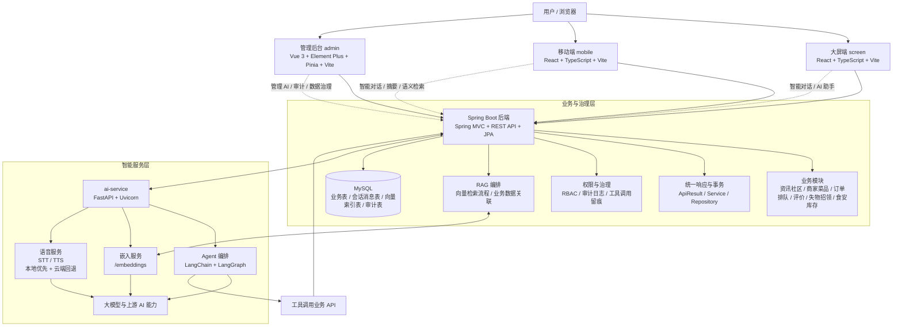

# 系统总体框架图（毕业论文）

> 论文题目：**融合 Agent 的 Spring Boot 智慧食堂一体化管理平台设计与实现**

---

## 1. 图题建议

可作为论文中的图题：

- **图 4-1 系统总体框架图**
- **图 4-1 智慧食堂一体化管理平台总体架构图**
- **图 4-1 融合 Agent 的智慧食堂系统总体逻辑架构图**

---

## 2. 一句话概述

本系统采用 **B/S + 前后端分离 + 智能服务解耦** 的总体架构：前端由大屏展示端、移动 H5 端和管理后台三端组成，统一通过浏览器访问；后端以 **Spring Boot** 作为业务与数据权威，负责 REST API、事务处理、JPA 持久化、RBAC 与审计留痕；智能能力由独立 **FastAPI ai-service** 承载，提供大模型对话、Agent 工具调用、向量嵌入与语音能力，并通过与 Spring Boot 的 HTTP 协作实现 RAG 检索、会话落库与可追溯治理。

---

## 3. 可直接放文档的 Mermaid 图

如果你的 Markdown 编辑器或知识库支持 Mermaid，可以直接使用下图；如果最终要放进 Word，可先在支持 Mermaid 的工具中渲染后导出 PNG / SVG。



---

## 4. 论文中的配文示例

可在图下方或正文中配套说明如下：

> 如图 4-1 所示，智慧食堂系统采用浏览器/服务器架构与前后端分离设计。前端包含大屏展示端、移动 H5 端和管理后台三类客户端，分别服务于信息展示、用户业务办理与后台运营管理。三端均不直接访问大模型服务，而是统一调用 Spring Boot 提供的 REST 接口。Spring Boot 作为系统的业务中枢，负责业务规则处理、事务管理、数据持久化、角色权限控制以及审计留痕，同时与独立部署的 ai-service 通过 HTTP 方式协同完成智能对话、Agent 工具调用、向量嵌入和语音处理等任务。该架构既保证了业务数据的一致性与安全性，也提升了智能模块的独立演进能力与工程可治理性。

---

## 5. 给其他 AI / 绘图工具的出图提示词

下面这段提示词适合丢给支持流程图/架构图生成的 AI，或者作为 draw.io、Visio 手动画图的蓝本。

```text
请绘制一张“融合 Agent 的 Spring Boot 智慧食堂一体化管理平台总体框架图”，风格要求为论文插图风格、白底、简洁、学术化、蓝灰配色、中文标签清晰、适合直接放入毕业论文。

图中采用自上而下的分层结构，共分为 4 层：

第 1 层：用户与访问层
- 用户 / 浏览器

第 2 层：前端表示层
- 大屏端 screen：React + TypeScript + Vite
- 移动端 mobile：React + TypeScript + Vite
- 管理后台 admin：Vue 3 + Element Plus + Pinia + Vue Router + Axios + Vite
- 三端独立工程，共享同一套后端 REST API

第 3 层：业务与治理层（Spring Boot）
- Spring Boot 后端
- Spring MVC / REST API
- Spring Data JPA
- 统一响应 ApiResult
- 业务模块：资讯社区、商家菜品、订单排队、评价、失物招领、食安与库存
- 权限治理：RBAC
- 审计与可追溯：会话留痕、工具调用留痕、审计日志
- RAG 检索编排：Java 侧负责向量检索流程与业务数据关联

第 4 层：智能服务层（Python ai-service）
- FastAPI + Uvicorn
- LangChain + LangGraph
- Agent 对话编排
- 工具白名单（按 clientType 与 role 控制）
- Embeddings 接口
- 语音能力：STT / TTS，本地优先，云端回退
- 大模型与上游 AI 服务

底部单独绘制数据层：
- MySQL
- 包含：业务表、AI 会话表、消息表、帖子向量索引表、审计表

关键连线要求：
- 浏览器连接三端前端
- 三端前端统一调用 Spring Boot REST API
- Spring Boot 与 ai-service 之间双向 HTTP 通信
- ai-service 中的 Agent 工具调用需要回连 Spring Boot 业务 API
- Spring Boot 连接 MySQL
- Embeddings 能力与 RAG 检索编排存在协作关系
- 浏览器不能直连 AI 密钥或大模型服务，要体现“由 Java 转发/编排”的 BFF 思路

请在图中突出以下设计要点：
- B/S 架构
- 前后端分离
- 多端统一服务
- 智能能力解耦部署
- RAG + Agent + 语音融合
- 权限控制与审计可追溯

输出要求：
- 生成论文风格系统架构图
- 所有模块用矩形框表示
- 箭头清晰标出调用关系与数据流向
- 中文字体清晰，避免花哨图标
- 适合 A4 论文页面插图
```

---

## 6. 如果要做成答辩或论文最终版图片

推荐版式：

- **布局**：自上而下四层结构，底部数据库单独一层。
- **颜色**：前端层浅蓝，Spring Boot 层浅青，AI 层浅紫，数据层浅灰。
- **箭头**：实线表示主调用链路，虚线表示智能扩展链路。
- **图中文字**：尽量控制在模块名 + 技术名，不要塞过多说明句。

建议最终图名可写为：

- `图4-1 系统总体框架图`
- `图4-1 融合Agent的智慧食堂系统总体架构图`

